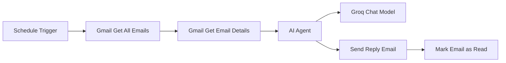

# Email Reply Automation

## Overview

This project is an AI-powered email reply automation workflow built using n8n, Gmail, and Groq AI.

The workflow automatically checks for unread emails, reads the email content, generates a professional response using AI, sends the reply to the sender, and marks the email as read to avoid duplicate responses.

---

## Architecture Diagram



---

## Workflow Steps

### 1. Schedule Trigger

The workflow starts automatically at a scheduled interval.

### 2. Gmail Get All Emails

Fetches unread emails from the Gmail inbox.

### 3. Gmail Get Email Details

Retrieves the complete content of each email.

### 4. AI Agent

Processes the email content and prepares a suitable response.

### 5. Groq Chat Model

Generates an intelligent and professional email reply.

### 6. Send Reply Email

Automatically sends the generated response to the sender.

### 7. Mark Email as Read

Marks the processed email as read to prevent duplicate replies.

---

## Technologies Used

- n8n
- Gmail API
- Groq AI
- Workflow Automation
- Mermaid Diagrams
- GitHub

---

## Project Structure

```text
email-reply-automation/
│
├── README.md
├── workflow.json
└── screenshots/
```

---

## Learning Outcomes

- Learned workflow automation using n8n
- Integrated Gmail with AI services
- Generated automated email responses
- Created architecture diagrams using Mermaid
- Documented automation workflows
- Managed projects using GitHub

---

## Author

Rabbani
